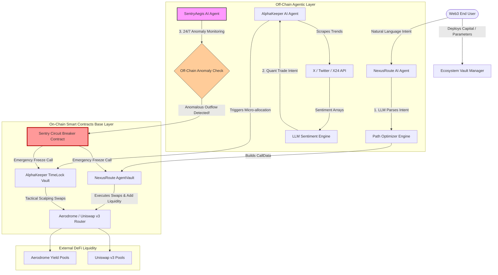

# web3-agent-collection

[](https://base.org)
[](https://ollama.com)
[](https://github.com/coinbase/agentkit)
[](https://github.com/foundry-rs/foundry)
[](https://www.typescriptlang.org/)
[](https://expressjs.com/)

A unified, production-grade repository combining autonomous AI agents, intent-driven DeFi execution, and algorithmic risk mitigation on the Base network. This ecosystem showcases the future of decentralized autonomous finance by binding TypeScript-driven LLM multi-agents to ultra-secure, immutable Solidity vaults.

## 1. Project Overview & Synergy

The **AegisNexus Alpha (ANA)** ecosystem solves three fundamental challenges of modern AI-DeFi interaction: **Security Vulnerability (Prompt Injection / Exploits)**, **User Experience Friction (Complex DeFi Workflows)**, and **Information Asymmetry (Dynamic Off-chain Market Data)**. 

Rather than working in isolation, these three systems create an end-to-end autonomous asset lifecycle:
1. **AlphaKeeper AI** detects market signals from social layers and deploys small-cap tactical capital.
2. **NexusRoute AI** abstracts complex execution paths, ensuring that routing capital into primary yield pools is highly optimal and intent-driven.
3. **SentryAegis AI** wraps the entire infrastructure in a 24/7 automated monitoring layer, functioning as an on-chain/off-chain dual-circuit breaker to freeze assets instantly if anomalies or prompt-injection behaviors are detected.

## 2. The Core Multi-Agent Suite

### i. 🛡️ SentryAegis AI (Automated Risk Control & On-Chain Circuit Breaker)
* **The Problem:** Autonomous AI agents operating Web3 wallets are vulnerable to **Prompt Injection attacks** and anomalous market conditions. A malicious actor could manipulate an LLM's inputs, forcing it to drain its entire underlying vault.
* **The Solution:** A dual-layer fail-safe. An off-chain TypeScript agent continuously monitors wallet out-flows and protocol state anomalies. If an unapproved large-volume asset transfer or unauthorized counterparty is detected, it triggers a cryptographically signed transaction to an immutable on-chain Solidity Circuit Breaker, locking down the vault in under a single block.

### ii. ⚡ NexusRoute AI (Intent-Driven Liquidity Aggregator & Guardrail Vault)
* **The Problem:** Executing advanced multi-step yield or swap positions in DeFi requires manual sequence approvals (`Approve -> Swap -> Provide Liquidity -> Stake`), generating immense gas friction and cognitive load.
* **The Solution:** An Intent-Based execution infrastructure. Users submit cross-protocol intents via natural language (e.g., *"Rebalance 100 USDC into the highest-yielding stablecoin pool on Base"*). The TypeScript Agent interprets the request, calculates the optimal routing topology across Aerodrome and Uniswap v3, bundles the transactions, and pulls funds securely via an authenticated `AgentVault` contract.

### iii. 📈 AlphaKeeper AI (Sovereign Quant Engine & Timelocked Alpha Vault)
* **The Problem:** Modern quantitative trading bots are completely centralized, requiring custody of private keys on third-party servers. Conversely, vanilla smart contracts are deaf to off-chain behavioral trends and community sentiment dynamics.
* **The Solution:** A fully autonomous, sovereign quantitative agent. AlphaKeeper constantly scrapes off-chain alpha sources (Twitter/X API, X24) and processes sentiment arrays via customized LLMs. When an alpha threshold is breached, the agent initiates high-frequency micro-allocations directly out of a secure on-chain Time-Locked Vault, balancing autonomous trading agility with hardbound liquidity escape hatches.

## 3. Tech Stack

### Agentic & Off-Chain Layer
* **Runtime Environment:** Node.js (v20+), TypeScript
* **AI Orchestration:** LangChain / LangGraph (for complex stateful multi-agent decision loops)
* **LLM Engine:** OpenAI GPT-4o / Anthropic Claude 3.5 Sonnet (Structured JSON Outputs)
* **Data Pipelines:** X (Twitter) Developer API v2, Elfa API, On-chain block listening via Viem / Ethers.js

### Smart Contract & On-Chain Layer
* **Language:** Solidity (v0.8.24, utilizing EVM Cancun transient storage opcodes where applicable)
* **Framework:** Foundry (Forge for compilation and testing, Anvil for local node simulation)
* **Base Infrastructure:** OpenZeppelin Contracts (Sausage-dog guards, AccessControl, Pausable, ReentrancyGuard)
* **DeFi Integrations:** Aerodrome Finance Router interfaces, Uniswap v3 Factory & SwapRouter

## 4. Contract Architecture

The architecture relies on strict decoupling between off-chain AI decision logic and on-chain state execution. All administrative operations require valid cryptographic signatures or specific access roles managed via OpenZeppelin `AccessControl`.



## 5. Project Structure

```plaintext
aegisnexus-alpha-root/
├── .env.example                 # Template for multi-agent keys and RPC endpoints
├── README.md                    # Root documentation ecosystem guide
├── package.json                 # Core workspaces and script definitions
├── contracts/                   # Foundational Smart Contracts (Foundry Project)
│   ├── lib/                     # Forge dependencies (OpenZeppelin, Forge-std)
│   ├── src/                     # Core Solidity Source
│   │   ├── SentryCircuit.sol    # Dual-layer off/on-chain asset freezer
│   │   ├── AgentVault.sol       # Intent execution vault with hard limits
│   │   └── AlphaTimeLock.sol    # Quant capital lock with strict cooldown windows
│   ├── script/                  # Deployment & Configuration Scripts
│   │   ├── DeployEcosystem.s.sol
│   │   └── Interact.s.sol
│   └── test/                    # In-depth fuzz and invariant test suite
│       ├── SentryCircuit.t.sol
│       ├── AgentVault.t.sol
│       └── AlphaTimeLock.t.sol
└── agents/                      # Multi-Agent Intelligent Core (TypeScript)
    ├── src/
    │   ├── index.ts             # Orchestrator Entrypoint
    │   ├── sentry/              # SentryAegis Agent Node
    │   │   ├── monitor.ts       # On-chain state & transaction listener
    │   │   └── promptGuard.ts   # Local text validation layer to bypass injection
    │   ├── nexus/               # NexusRoute Agent Node
    │   │   ├── parser.ts        # Intent translator (Text-to-CallData)
    │   │   └── router.ts        # Liquidity path aggregator calculations
    │   └── alpha/               # AlphaKeeper Agent Node
    │       ├── scraper.ts       # Social protocol ingestion stream
    │       └── strategy.ts      # LLM quant logic and execution generator
    └── package.json
```

## 6. Key Features & Mechanics

| Feature | SentryAegis AI | NexusRoute AI | AlphaKeeper AI |
| :---| :--- | :--- | :--- |
| Primary Domain | Risk & System Isolation | Multi-step Transaction Abstraction | Narrative & Sentiment Alpha |
| On-Chain Guard | Instant Circuit Breaker | Per-Transaction Outflow Limits | Enforced Cooldown TimeLocks | 
| Security Layer | Vector-based prompt injection detection | Cryptographic signature whitelisting | Multi-sig parameter update limits |
| Target DEXs | All Connected Pools | Aerodrome, Uniswap v3 (Base) | Uniswap v3 (Low-cap/High-cap pairs) |

- **Deterministic Outflow Ceilings:** The `AgentVault` imposes strict bounds. Even if an LLM goes rogue, it cannot process a transaction greater than the predefined parameter without triggering a multi-sig delay.

- **Transient Cooldown Controls:** `AlphaTimeLock` enforces that once capital is deployed for a short-term quant strategy, it cannot be recycled into another low-cap pool until a predefined block interval passes, preventing high-frequency flash-drain vectors.

## 7. Getting Started

### Prerequisites

- Foundry / Forge installed locally.

- Node.js v20+ and `npm` / `yarn` / `pnpm`.

### 1: Environment Setup

Clone the repository and set up your variables in both the root and child directories:


### 2: Smart Contract Local Testing & Deployment

## 👨‍💻 Author

**Jacob Lin**
_Algorithm Engineer & Full-Stack Developer_
[LinkedIn](https://www.linkedin.com/in/dachunglin) | [Email](mailto:overcomerlin@gmail.com)

_"A ranger soaring through the world of algorithms."_