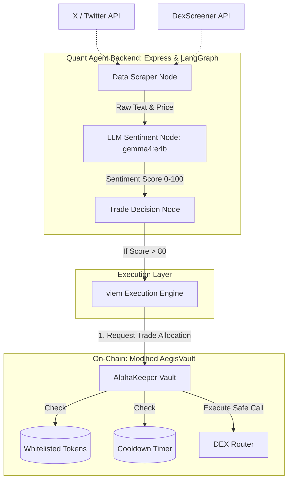

# AlphaKeeper AI: Quantitative Strategy Agent & Time-Locked Vault

[](https://base.org)
[](https://langchain-ai.github.io/langgraph/)
[](https://ollama.com)
[](https://viem.sh)

## 📋 Overview

**AlphaKeeper AI** bridges the gap between off-chain social sentiment and on-chain autonomous trading while maintaining rigorous cryptographic security. 

Traditional quantitative bots are highly centralized, leaving user funds vulnerable to infrastructure hacks. Conversely, pure smart contracts cannot natively read off-chain social data like Twitter/X momentum or DexScreener trends. 

AlphaKeeper solves this by utilizing a **LangGraph-powered AI Agent** that asynchronously scrapes real-time social data, evaluates meme-coin momentum using local **Ollama (Gemma 4)** sentiment analysis, and executes high-frequency trades. To ensure absolute asset security, the agent does not hold funds directly. Instead, it requests capital from an enhanced **AegisVault**, which enforces strict daily limits, trading cooldowns (Time-locks), and an immutable `isWhitelistedToken` mapping, ensuring the AI can only purchase pre-approved assets.

## 🏗️ System Architecture



## 📂 Project Structure

```plaintext
alpha-keeper-ai/
├── docker-compose.yml              # Multi-container orchestration (Node, Frontend, Anvil, Ollama)
├── package.json                    # Monorepo workspace
├── apps/
│   ├── web-dashboard/              # React + Vite + Tailwind Control Panel
│   └── quant-agent/                # TypeScript Node.js Backend
│       ├── src/
│       │   ├── scraper/            # X24 / DexScreener async listeners
│       │   ├── workflow/           # LangGraph state machine definitions
│       │   └── index.ts            # Express API entry
│       └── Dockerfile
└── packages/
    └── contracts/                  # Solidity Smart Contracts
        ├── src/
        │   └── AlphaAegisVault.sol # Time-locked & Whitelisted extension of AegisVault
        └── foundry.toml
```

## ✨ Key Features

- **LangGraph Workflows:** Handles complex, multi-step asynchronous data scraping, LLM evaluation, and retry logic seamlessly within a cyclical graph structure.
- **Local Sentiment Analysis:** Utilizes Ollama (`gemma4:e4b`) to parse unstructured social media hype, outputting deterministic risk/reward scores.
- **Token Whitelisting:** The smart contract explicitly rejects transactions targeting unverified tokens (`mapping(address => bool) isWhitelistedToken`), preventing the AI from falling for honeypots.
- **Time-Lock Cooldowns:** Enforces a minimum block-time delay between consecutive agent withdrawals to prevent rapid flash-crashes and excessive gas burning.
- **Express / React Dashboard:** Provides human operators with real-time visibility into the LangGraph state, current sentiment scores, and one-click access to the vault's emergency circuit breaker.

## 🛠️ Tech Stack

- **Agent Engine:** TypeScript, Node.js, LangGraph JS
- **Local Intelligence:** Ollama (`gemma4:e4b`)
- **Web3 Interface:** Viem
- **Smart Contracts:** Solidity (`^0.8.20`), Foundry (Anvil Sandbox)
- **Frontend App:** Vite, React, TailwindCSS, shadcn/ui
- **Containerization:** Docker Compose

## 🚀 Getting Started

### Prerequisites

- Docker & Docker Compose V2
- Foundry Toolchain
- Access to X API & DexScreener API keys

### 1. Environment Configuration

Clone the repository and configure apps/quant-agent/.env:

```bash
PORT=5000
RPC_URL=http://anvil:8545
OLLAMA_URL=http://ollama:11434
VAULT_ADDRESS=0xYourVaultAddress
AGENT_PRIVATE_KEY=0xYourAgentKey
X_API_KEY=your_twitter_api_key
```

### 2. Initialization & Build

Launch the system utilizing Docker Compose. This boots the Anvil EVM sandbox, Ollama LLM, and the LangGraph workflow engine:

```bash
docker-compose up --build
```

### 3. Triggering the Workflow

To manually invoke the quantitative scraping cycle:

```bash
curl -X POST http://localhost:5000/api/v1/trigger-cycle \
  -H "Content-Type: application/json" \
  -d '{"targetTicker": "$PEPE"}'
```

## 📡 API Reference

### Trigger Quant Evaluation Cycle

- Endpoint: POST /api/v1/trigger-cycle
- Payload: {"targetTicker": "string"}
- Response:

```json
{
  "status": "success",
  "sentimentScore": 88,
  "decision": "EXECUTE_BUY",
  "executionTx": "0xabc123..."
}
```

## 📈 Scalability & Future Roadmap

### Execution Strategy:

The development lifecycle is managed via strict phase gates optimized for our three-member engineering pod, led by PgM oversight.

- **Regressions:** Routine system maintenance, unit testing of the `isWhitelistedToken` contract logic, and X API health checks are managed as standard weekly Regressions.
- **Experiments & Sweeps:** Ad-hoc algorithm tuning, prompt engineering for Gemma 4, and testing new LangGraph decision nodes are executed as on-demand Experiments to discover new Alpha without breaking production baselines.

### Future Milestones:

- **Dynamic Stop-Loss:** Integrating Viem event listeners to automatically trigger sell-offs if a whitelisted token drops 15% within 1 hour.
- **Cross-Chain Arbitrage:** Expanding the LangGraph execution node to scan and bridge assets across Base and Arbitrum via CCIP.