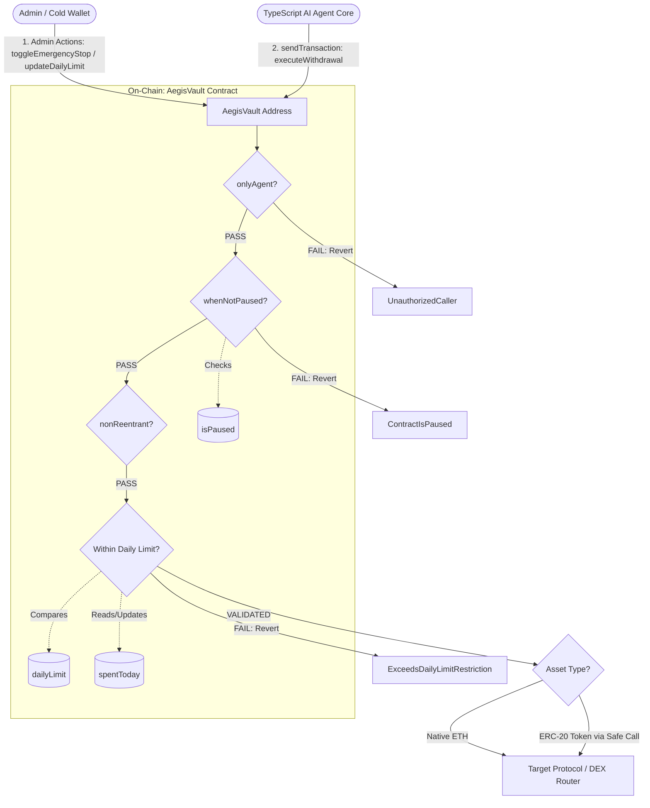

# AegisVault: Defensive On-Chain Smart Contract Vault for AI Agents

[](https://github.com/foundry-rs/foundry)
[](https://opensource.org/licenses/MIT)
[](https://base.org)

## 📋 Overview

**AegisVault** is a production-grade, gas-optimized, **defensive on-chain smart contract vault** designed specifically for autonomous AI Agents.

In the current Web3 AI ecosystem, AI Agents typically require direct control over a decentralized hot wallet's private key. This introduces severe security vulnerabilities: **Prompt Injection attacks**, zero-day exploits in the server backend, or severe hallucinations within the AI model itself could all result in the hot wallet's funds being maliciously drained in an instant.

AegisVault implements a **Defense in Depth** model. It rigidly isolates the AI Agent's "operational execution rights" from "asset control rights" at the fundamental blockchain layer. Even if the Agent's backend server is completely compromised, an attacker will be entirely unable to breach the daily transaction limits and emergency circuit breakers hardlocked on-chain by the vault contract.

## 🛠️ Tech Stack

- **Smart Contract Language:** Solidity `^0.8.20`
- **Development Framework:** Foundry (Forge, Cast, Anvil)
- **EVM Target Environment:** `Cancun` hard fork optimization (perfectly tailored for the Base L2 network)
- **Architecture Philosophy:** Zero external dependencies, ultra-lightweight design, and low-level secure calls

## 🏗️ Contract Architecture

AegisVault utilizes a dual-role authorization architecture, ensuring that the operations of the execution layer (AI Agent) are under the absolute constraint of the management layer (Human Administrator / Cold Wallet).

### system Topology and Transaction Flow



## 📂 Project Structure

AegisVault fits seamlessly within a modern standard Foundry or Monorepo setup:

```Plaintext
aegis-agent-vault/
├── foundry.toml          # Centralized configuration with compiler optimization rules
├── remappings.txt        # Path remappings for contract dependencies
├── src/
│   └── AegisVault.sol    # Core Defensive Vault implementation
├── script/
│   └── DeployAegisVault.s.sol # Automated deployment & initialization script
└── test/
    └── AegisVault.t.sol  # Exhaustive unit & edge-case testing harness
```

## ✨ Key Features

1. **Defense-in-Depth Circuit Breaker:** Allows the owner to execute an instantaneous `toggleEmergencyStop()`, putting the vault into a structural pause state that renders all agent withdrawal privileges inert.
2. **24-Hour Rolling Spending Restraints:** Integrates an automatic, time-window checking routine that tracks `spentToday` against `dailyLimit`. Resets completely upon the arrival of a new 24-hour block timestamp epoch.
3. **Custom Error Optimization:**Replaces bloated legacy `require` string errors with native Solidity `error` models (e.g., `error UnauthorizedCaller()`). This reduces contract bytecode sizing and saves up to 30% on transaction deployment and failure Gas overheads.
4. **Zero-Dependency Reentrancy Protection:** Employs a custom, ultra-efficient internal state mutex guard (`nonReentrant`), eliminating heavy external dependency footprints like OpenZeppelin’s `ReentrancyGuard`.
5. **Polymorphic Asset Allocation:** Handles both Native Assets (ETH) and arbitrary ERC-20 standard tokens flawlessly through deterministic low-level `call` injections, accommodating tokens with non-standard return formats.

## 🚀 Getting Started

### Prerequisites

Ensure the local environment has the Foundry toolchain installed

```bash
curl -L [https://foundry.paradigm.xyz](https://foundry.paradigm.xyz) | bash
foundryup
```
### 1. Installation & Initiallization

Navigate to your smart contract package directory and build the codebase:

```bash
cd packages/aegis-agent-vault
forge install foundry-rs/forge-std --no-commit
forge build
```

### 2. Running the Test Suite

AegisVault includes rigorous unit testing simulating malicious hacker hijacking, limit overflow conditions, and emergency pausing:

```bash
forge test -v
```

### 3. Local Sandbox Deployment (Anvil)

To test how your TypeScript Agent will communicate with the contract in real-time, spin up an Anvil local chain instance:

```bash
# Terminal 1: Spin up local blockchain node
anvil
```
Anvil will output 10 accounts. Copy the first Private Key like: (0) `0xf39fd6e51aad88f6f4ce6ab8827279cfffb92266...` for sandbox development.

Open an alternative terminal instance to trigger the Forge deployment script:

```bash
# Terminal 2: Export your Anvil Private Key & broadcast contract to your local chain
export PRIVATE_KEY=0xf39fd6e51aad88f6f4ce6ab8827279cfffb92266
forge script script/DeployAegisVault.s.sol --rpc-url [http://127.0.0.1:8545](http://127.0.0.1:8545) --broadcast
```

Your deployment artifact will output a JSON signature indicating the contract instantiation address (typically default mapped to `0xe7f1725e7734ce288f8367e1bb143e90bb3f0512`).

### 4. Direct Node Inspection via Cast

Verify the configuration state parameters directly from the command line:

```bash
# Fix RPC target to local instance
export ETH_RPC_URL=[http://127.0.0.1:8545](http://127.0.0.1:8545)

# Fetch live vault asset balance (Will return 0.000000000000000000 ether initially)
cast balance 0xe7f1725e7734ce288f8367e1bb143e90bb3f0512 --ether

# Inspect current circuit breaker status (Returns false: Green Light)
cast call 0xe7f1725e7734ce288f8367e1bb143e90bb3f0512 "isPaused()(bool)"
```

### 5. Run Tests

Navigate to the project's root directory (ensure you are in the same folder as `foundry.toml`), and execute the following commands:

```bash
# Run all tests and display basic logs
forge test

# Run tests with detailed gas reporting and full call stacks
forge test -vvvv
```

## 📈 Scalability & Future Roadmap

AegisVault is engineered as an evolutionary module. Future milestones targeting deeper integration with TypeScript autonomous frameworks (e.g., *elizaOS*, *Coinbase AgentKit*) include:

- **Multi-Agent Intent Delegator:** Upgrading the single-agent address model to a multi-tiered permission schema, allowing custom daily allowances based on specific sub-agents (e.g., Alpha-Hunter vs. Sentry).
- **On-Chain Oracle Circuit Breakers:** Connecting pause states to Chainlink Data Feeds or specialized security oracles to instantly freeze the vault if a targeted external DeFi protocol suffers a public pool hack.
- **Dynamic Token Whitelisting:** Enforcing strict structural boundaries on the to addresses or target token interaction targets, preventing the AI from buying unverified tokens.
- **ERC-4337 Account Abstraction Wrapper:** Morphing AegisVault into an ERC-4337 Smart Account setup, allowing gasless user intents sponsored via paymasters while maintaining the internal risk guardrails.

## 👨‍💻 Author

**Jacob Lin**
_Algorithm Engineer & Full-Stack Developer_
[LinkedIn](https://www.linkedin.com/in/dachunglin) | [Email](mailto:overcomerlin@gmail.com)

_"A ranger soaring through the world of algorithms."_